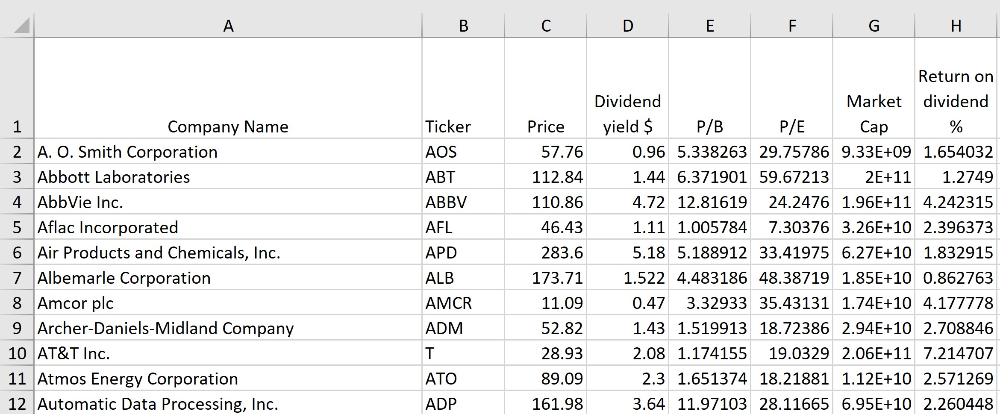

# Stocks Data Searcher
This Java program gathers data about stocks from Yahoo!Finance and writes them to the Excel file.

## Motivation 
This project has been created to get a clear and efficient way to analyze stock data.

## Design
Idea: Program reads stock tickers from the .txt file provided, gets data about them, generates new excel file and writes data into it.

Program handles lack of data for the particular stock by leaving row blank.

Sample Excel file output:

## Technologies

Language: Java 8

Libraries used for main tasks:

Creating and writing to the Excel - [Apache POI](https://poi.apache.org/)

Gethering stock data - [YahooFinance](https://financequotes-api.com/javadoc/yahoofinance/YahooFinance.html)
